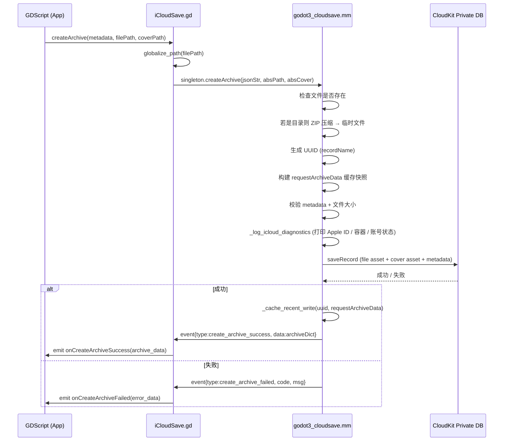
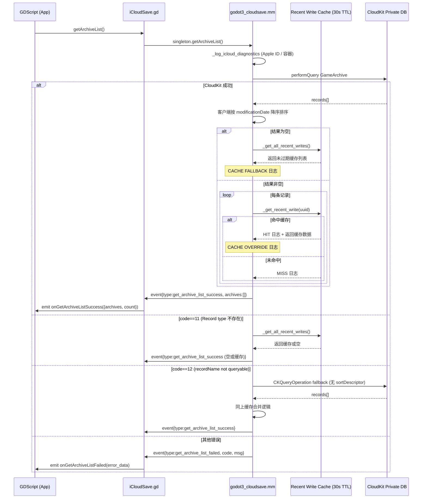
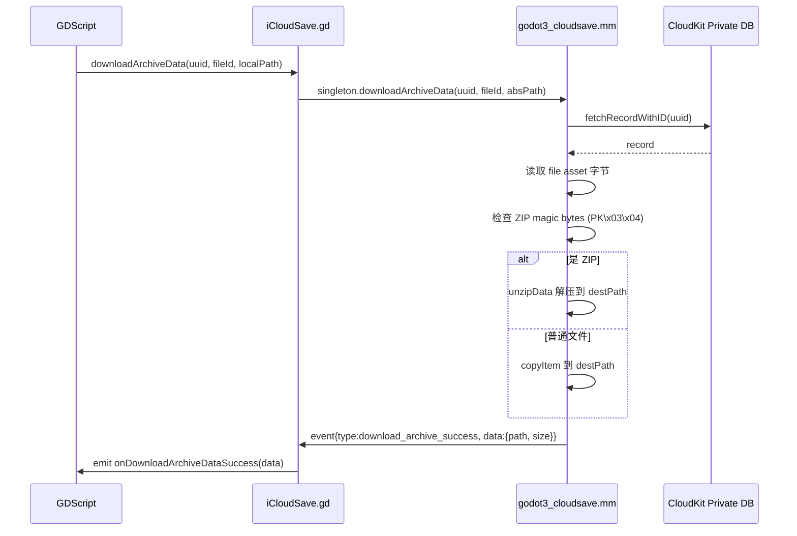
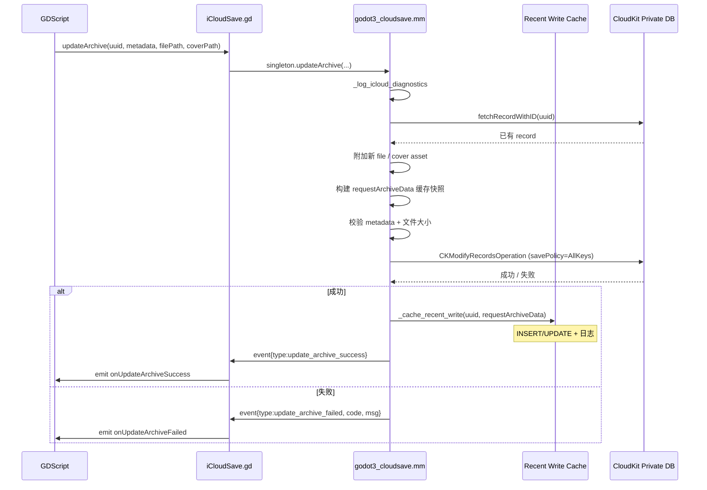
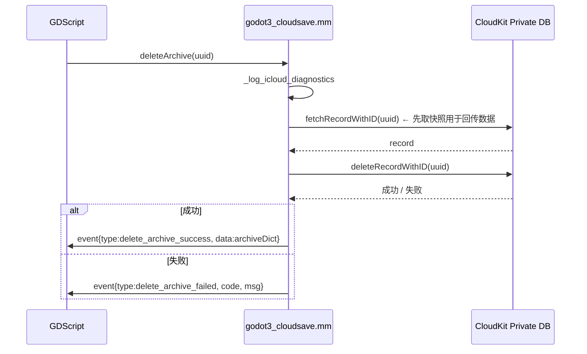

# CloudKit 数据库结构与工作流

## 一、容器与数据库层级

```
CKContainer  (iCloud.your.bundle.id)
├── privateCloudDatabase   ← 本插件使用。数据归属当前 Apple ID，其他用户不可见。
├── publicCloudDatabase    ← 本插件未使用。全体用户可读（需 ACL）。
└── sharedCloudDatabase    ← 本插件未使用。跨用户共享。
```

> **重要**：跨设备同步的前提是两台设备登录相同 Apple ID，因为 private 数据库按 Apple ID 隔离。

---

## 二、Record Type 结构

### GameArchive

| 字段名     | CK 字段类型 | 说明                                    |
|------------|-------------|-----------------------------------------|
| recordName | String      | 由客户端生成的 UUID，作为唯一主键        |
| metadata   | String      | JSON 字符串，包含 name/summary/extra/playtime |
| file       | Asset       | 存档文件（可为单文件或 ZIP，最大 10 MB） |
| cover      | Asset       | 封面图片（可选，最大 512 KB）            |
| ___createdAt | Date     | 由 CloudKit 服务端自动生成               |
| ___modifiedAt | Date    | 由 CloudKit 服务端自动维护               |

#### metadata JSON 内部结构

```json
{
  "name":     "save01",
  "summary":  "第3关 第2幕",
  "extra":    "{}",
  "playtime": 12345
}
```

字段约束：
- `name` 只允许 `[A-Za-z0-9_-]`，不能为空
- `summary` 不能为空
- `extra` 可为任意字符串
- `playtime` 为整数（毫秒）

---

## 三、必须在 CloudKit Console 部署的索引

> 这些不部署则 Production 下查询会报 `recordName not queryable` / `___modTime not sortable`

| 字段 / 系统字段 | 索引类型     | 必要性 | 备注           |
|-----------------|--------------|--------|----------------|
| recordName      | Queryable    | 必须   | 允许按 UUID 查单条 |
| ___modifiedAt   | Sortable     | 推荐   | 服务端排序；未部署时客户端兜底排序 |

部署步骤：  
CloudKit Console → 目标 Container → Schema → 切到 Development → Deploy Schema Changes to Production

---

## 四、完整工作流

### 4.1 创建存档（createArchive）



---

### 4.2 查询列表（getArchiveList）



---

### 4.3 下载存档（downloadArchiveData）



---

### 4.4 更新存档（updateArchive）



---

### 4.5 删除存档（deleteArchive）



---

## 五、缓存机制说明

```
写操作成功                               30秒后自动过期
createArchive ──► _cache_recent_write ──────────────► prune (过期日志)
updateArchive ──►
                                
getArchiveList 查询时：
  CloudKit 结果为空  → CACHE FALLBACK  → 返回缓存列表（日志: CACHE FALLBACK）
  CloudKit 有结果    → CACHE OVERRIDE  → 逐条用缓存替换（日志: CACHE OVERRIDE / HIT / MISS）
```

**缓存的目的**：CloudKit 写后读存在最终一致性延迟（通常数秒内，极端情况更长）。缓存避免"刚创建完存档，立刻查列表却返回空"的体验问题。

**缓存的风险**：若多设备/多账号场景下同一进程内有 30 秒内的写，查询结果会以本地写为准，可能掩盖跨设备同步问题。排查时应等待 >30 秒冷启动再测。

---

## 六、日志标签速查

| 日志标签 | 含义 |
|---|---|
| `[CloudSave][Diag]` | 诊断信息：Apple ID token、containerID、accountStatus、userRecordID |
| `[CloudSave][Cache] INSERT` | 首次写入缓存 |
| `[CloudSave][Cache] UPDATE` | 覆盖更新缓存 |
| `[CloudSave][Cache] HIT` | 命中缓存，age_ms 表示写入时间 |
| `[CloudSave][Cache] MISS` | 未命中缓存 |
| `[CloudSave][Cache] EXPIRE` | 条目因 TTL 过期被清除 |
| `[CloudSave] getArchiveList: CACHE FALLBACK` | CK 返回空，改用缓存 |
| `[CloudSave] getArchiveList: CACHE OVERRIDE` | CK 有数据但被缓存覆盖 |
| `[CloudSave] getArchiveList: final list count` | 最终返回数量（含缓存合并后） |
| `[CloudSave] createArchive: saving record ... container=` | 即将写入，含容器名 |
| `[CloudSave] createArchive: SUCCESS` | 写入成功，含 createdAt 时间戳 |
| `[CloudSave] updateArchive: SUCCESS` | 更新成功，含 modifiedAt 时间戳 |

---

## 七、跨设备同步必要条件清单

| 条件 | 验证方法 |
|---|---|
| 两台设备 Apple ID 相同 | 设置 → Apple ID；或对比日志中 userRecordID 是否一致 |
| 两台设备使用同一 CloudKit 环境 | 确认包来源一致（同为 TestFlight 或同为 App Store） |
| 设备 iCloud Drive 已开启 | 设置 → Apple ID → iCloud → iCloud Drive |
| App iCloud 权限已允许 | 设置 → Apple ID → iCloud → 对应 App 开关 |
| Production schema 已部署 | CloudKit Console → Schema → Production → GameArchive 存在 |
| Production 索引已部署 | CloudKit Console → Schema → Production → Indexes 包含 recordName(Queryable) |
